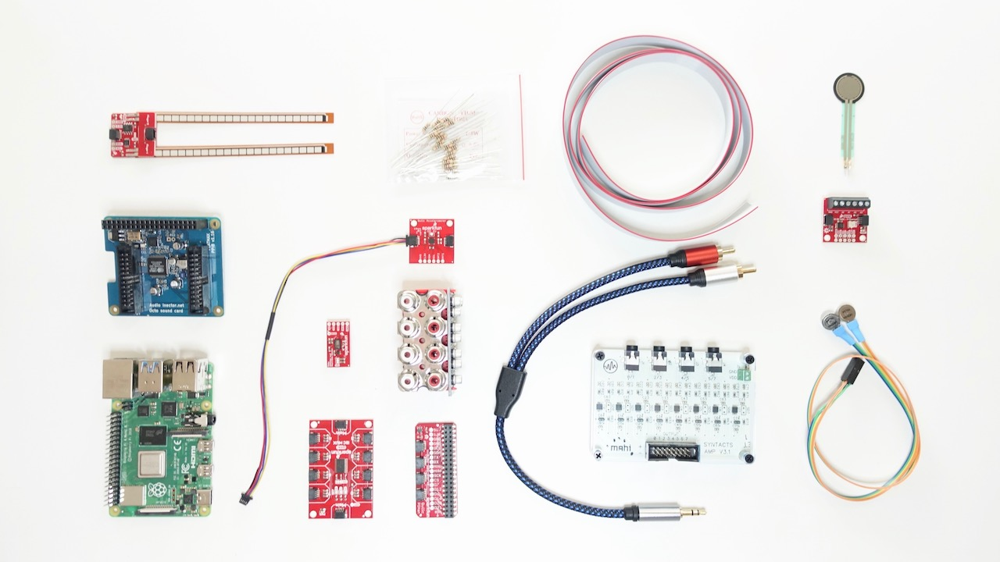

# WHC2021SIC-Guide | FAQ

Please always consider the most up to date version of this [FAQ online](https://github.com/WHC2021SIC/WHC2021SIC-Guide/blob/main/FAQ.md).



Guide for the IEEE World Haptics Conference 2021 Student Innovation Challenge: repositories

https://2021.worldhaptics.org/sic/

## Authors

- [Christian Frisson](https://frisson.re)
- [Jun Nishida](http://junnishida.net)
- [Heather Culbertson](https://sites.usc.edu/culbertson/)
- you?

Your contributions are welcome, here are your options to help us improve this guide:
- [review and open issues](https://github.com/WHC2021SIC/WHC2021SIC-Guide/issues)
- [create pull requests](https://github.com/WHC2021SIC/WHC2021SIC-Guide/pulls)
- contact WHC 2021 SIC chairs at [sic@2021.worldhaptics.org](mailto:sic@2021.worldhaptics.org)
## Contents

Generated with `npm run toc`, see [INSTALL.md](INSTALL.md).

Once this guide becomes very comprehensive, the main file can be split in multiple files and reference these files.

<!-- table of contents generated by running from repository root: npm run toc -->

<!-- toc -->

- [FAQ](#faq)
  * [Can we update our teams members composition?](#can-we-update-our-teams-members-composition)
  * [Can we run our demo on our own computers or boards instead of the Raspberry Pi?](#can-we-run-our-demo-on-our-own-computers-or-boards-instead-of-the-raspberry-pi)
  * [Can we use another operating system than Raspbian / Raspberry Pi OS on our Raspberry Pi?](#can-we-use-another-operating-system-than-raspbian--raspberry-pi-os-on-our-raspberry-pi)
  * [How do I install the Syntacts software on the Raspberry Pi?](#how-do-i-install-the-syntacts-software-on-the-raspberry-pi)
  * [Can we program our demo with Unity on the Raspberry Pi?](#can-we-program-our-demo-with-unity-on-the-raspberry-pi)
  * [I have another question, where/how do I ask?](#i-have-another-question-wherehow-do-i-ask)
- [Acknowledgements](#acknowledgements)
- [License](#license)

<!-- tocstop -->

## FAQ
### Can we update our teams members composition?

Short answer: it depends

Please check if your update request still complies with facts from the [WHC 2021 SIC call for participation](http://2021.worldhaptics.org/sic/) before submitting your request:
> The challenge is open to undergraduate and graduate students. 
> Teams may have between 2 and 5 members. 
> Teams are free to enlist one creative professional as advisor among professors, teachers, designers, engineers; but the work must be done by the students only, and all team members must be students at the time of submitting the application.

To enable us SIC chairs to make an informed decision, please send us an updated version of your proposal with these additions:
1. Personal statement of new potential member(s)
2. Revised proposed timeline with clearly identified assignments between members and tasks

Then we SIC chairs will get back to you with our decision.

### Can we run our demo on our own computers or boards instead of the Raspberry Pi?

Short answer: no

Facts from the [WHC 2021 SIC call for participation](http://2021.worldhaptics.org/sic/) before submitting your request:
> Teams can only use actuators, sensors, boards, and electronics hardware included with the hardware kit; but are free to create their own mechanical components as long as these can be replicated from easily sourceable home/office supplies (cardboard, paper clips, rubber bands…), not requiring automated fabrication hardware such as laser cutters or 3d printers. 

Please contact us SIC chairs if you believe that you have met a blocking issue with your hardware, ideally through [guide issues](https://github.com/WHC2021SIC/WHC2021SIC-Guide/issues) so that all teams can benefit from the discussion.

### Can we use another operating system than Raspbian / Raspberry Pi OS on our Raspberry Pi?

Short answer: no

We SIC chairs can not provide support for many operating systems such as other Linux variants and Windows and Android. Unifying the operating system accross teams was one of the motivations of providing a Raspberry Pi in the first place.

Student teams are free to explore other operating systems with their SIC hardware **after** the challenge.

### How do I install the Syntacts software on the Raspberry Pi?

This summary was raised in this issue: https://github.com/WHC2021SIC/Syntacts/issues/1

The [Syntacts Quick Start guide](https://github.com/WHC2021SIC/Syntacts#quick-start) applies to operating systems for which Syntacts binary releases are available (macOS and Windows). For Linux operating systems, including for the Raspberry Pi, **an extra step is needed: compiling the source code to build the GUI and libraries**.

From the tutorials linked in the README right below Quick Start, you will find the [Building tutorial](https://www.syntacts.org/tutorials/building/), from its last section Building on Linux.

Regarding:

> Note that you’ll need to install additional development files for any features you want to support (e.g., GTK+3, JACK).

You can install these dependencies from a terminal:
```
sudo apt install cmake libasound2-dev libgtk-3-dev
```

(package names identified from this list: https://www.raspberryconnect.com/raspbian-packages/77-raspbian-libdevel)

If you want Jack audio connection support, you may also install `libjack-dev` (v1) or `libjack-jackd2-dev` (v2).

### Can we program our demo with Unity on the Raspberry Pi?

Short answer: not currently

To the best of our knowledge, Unity3D does not run on Raspberry Pis with the official/main raspbian (debian) default OS.

Unity3D seemingly may work with Windows IoT or Android, but with serious performance degradations, and these operating systems are not allowed for the WHC 2021 SIC challenge:
https://www.quora.com/Is-it-possible-to-make-Unity3D-projects-for-the-Raspberry-Pi?share=1
https://www.instructables.com/Raspberry-Pi-Running-Unity/

Godot is an open-source alternative that may work on Raspberry Pis:
https://raspberrypi.stackexchange.com/questions/116758/unity-style-game-engine-for-raspberry-pi-4b
https://github.com/godotengine/godot-proposals/issues/988
https://github.com/hiulit/Unofficial-Godot-Engine-Raspberry-Pi

Note that Unity is also the name of a desktop environment for Ubuntu, making search for information harder.
https://en.wikipedia.org/wiki/Unity_(user_interface)

### I have another question, where/how do I ask?

Ideally through [guide issues](https://github.com/WHC2021SIC/WHC2021SIC-Guide/issues) so that all teams can benefit from the discussion.

## Acknowledgements

SIC chairs would like to thank Evan Pezent, Zane A. Zook and Marcia O'Malley from [MAHI Lab](http://mahilab.rice.edu) at Rice University for having distributed to them 2 [Syntacts](https://www.syntacts.org) kits for the [IROS 2020 Intro to Haptics for XR Tutorial](http://iros-haptics-tutorial.org/). 
SIC co-chair Christian Frisson would like to thank Edu Meneses and Johnty Wang from [IDMIL](http://idmil.org) at McGill University for their recommendations on Raspberry Pi hats for audio and sensors.

## License

This documentation is released under the terms of the Creative Commons Attribution Share Alike 4.0 International license (see [LICENSE.txt](LICENSE.txt)).
