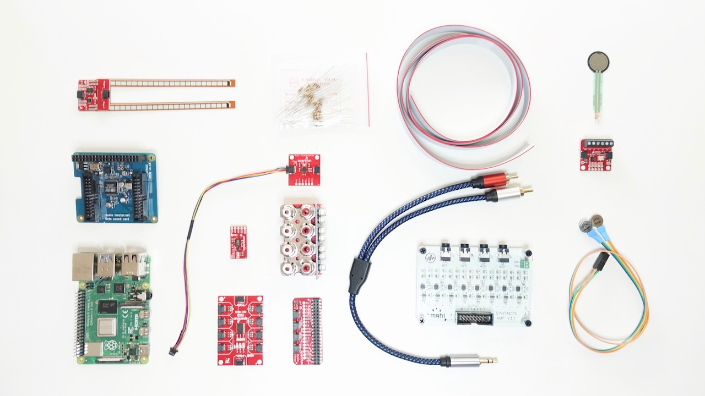

# WHC2021SIC-Guide Main

Guide for the IEEE World Haptics Conference 2021 Student Innovation Challenge

https://2021.worldhaptics.org/sic/

## Authors

- [Christian Frisson](https://frisson.re)
- [Jun Nishida](http://junnishida.net)
- [Heather Culbertson](https://sites.usc.edu/culbertson/)
- you?

Your contributions are welcome, here are your options to help us improve this guide:
- [review and open issues](https://github.com/WHC2021SIC/WHC2021SIC-Guide/issues)
- [create pull requests](https://github.com/WHC2021SIC/WHC2021SIC-Guide/pulls)
- contact WHC 2021 SIC chairs at [sic@2021.worldhaptics.org](mailto:sic@2021.worldhaptics.org)

## Contents

Generated with `npm run toc`, see [INSTALL.md](INSTALL.md).

Once this guide becomes very comprehensive, the main file can be split in multiple files and reference these files.

<!-- table of contents generated by running from repository root: npm run toc -->

<!-- toc -->

- [Getting Started](#getting-started)
- [FAQ](#faq)
- [Acknowledgements](#acknowledgements)
- [License](#license)

<!-- tocstop -->

## Getting Started

Check the [Getting Started](GettingStarted.md) guide.

## FAQ

Questions? Start by checking the [FAQ](FAQ.md)!

## Acknowledgements

SIC chairs would like to thank Evan Pezent, Zane A. Zook and Marcia O'Malley from [MAHI Lab](http://mahilab.rice.edu) at Rice University for having distributed to them 2 [Syntacts](https://www.syntacts.org) kits for the [IROS 2020 Intro to Haptics for XR Tutorial](http://iros-haptics-tutorial.org/). 
SIC co-chair Christian Frisson would like to thank Edu Meneses and Johnty Wang from [IDMIL](http://idmil.org) at McGill University for their recommendations on Raspberry Pi hats for audio and sensors.

## License

This documentation is released under the terms of the Creative Commons Attribution Share Alike 4.0 International license (see [LICENSE.txt](LICENSE.txt)).
